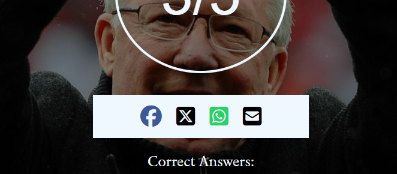

# Manchester United Fan Quiz
This website was designed to enthrall users who may be Manchester United fans or Premier League fans to participate in a quiz to test their football knowledge. This website was designed to be aesthetically pleasing and fun to use.
The user can also interact with friends through social media to challenge them to get a better score. The user is also able to see the correct answers after completing the quiz and see which question he answered correctly.

## User Experience (UX)

#### Key information for the site
This website is designed to be an interactive quiz for fans of Manchester United or just fans of the Premier League. The main goal of the website is for the user to enjoy the quiz and to give a nostalgic feel of the 2007/08 season. This website would be useful to add an interactive feature to a website dedicated to football or sport. 

### User Stories

#### Client Goals
<li>To be able to acces the website on different devices</li>
<li>To make it easy for users to see the websites goals</li>
<li>For the user to be able to complete the quiz and see their results</li>
<li>For users to be able to share their results with friends and invite them to partake in the quiz</li>

#### First Time Visitors Goals
<li>To be able to find out what the page is about</li>
<li>To be able to navigate through the website</li>
<li>To be able to find the social media connection</li>

#### Returning Visitor Goals
<li>To be able to partake in a quiz with different questions around the topic of football</li>
<li>To beat their friends score</li>

#### Frequent Visitor Goals
<li>To partake in a quiz with different questions and topics</li>

## Design 

### Colour Scheme
The colors I used are based on the Manchester United brand. These colors include: #DA291C, aliceblue, #AA291C, black etc.

### Typography
I used a google font by the name of Sedan to give the website a sophisticated look. 

### Imagery
I went out of my way to find high quality background images which are relevant to the topic of the quiz and to improve the aesthetics of the page.

## Features

### Homepage

Here we have a full sized background-image instantly informing the user about the topic of choice for the page. We have a title informing the user of the function of this page. The 'Sedan' google font is used to give a sophisticated look. The line above the title and the button have been given colors inline with the Manchester United brand.

### Quiz questions

 Here we have the beginning of the quiz with a background-image relevant to the topic. It allows the user to select an answer from the options given. Everytime a user selects an answer a new question is presented, the question number/line is updated and a new background-image appears. The lines ontop of the question are present for aesthetic purposes.

### Results Page

Once the user has completed the quiz, the result page is presented with their score and some feedback. The user has the option to select the challenge button to challenge a friend and/or press the correct answers button to see the answer they got correct.

### Challenge Button

When the user clicks on the challenge button they have the options to message a friend about the quiz on different social media platforms and challenge them.

### Correct Answers

When the user clicks on the correct answers button they are presented with the correct answers to the questions and also presented with either a green tick or red cross icon, depending on whether or not they answered the question correctly.

## Accessibility
I've been careful to try to make this website as accessible as possible. I've done this by:
<li>Ensuring that I use the correct semantic HTML,</li>
<li>Using the aria-label attribute when using icons,</li>
<li>By using colors that have strong contrast.</li>

## Technologies Used

I used HTML, CSS and Javascript to create this website.

The programs I used include:
<li>GitHub - To store files for the website,</li>
<li>Git - for version control,</li>
<li>Google fonts - To import the font I use on the website,</li>
<li>Font Awesome - for the icons used on this website,</li>
<li>Google Dev tools - To find and resolve issues with styling. Also used the Lighthouse feature,</li>
<li>Am I Responsive - To show the website images on different sized devices.</li>

## Deployment & Local Deployment

### Deploymment
I used GitHub Pages to deploy the website. This is how I did it:
<ol>
<li>I logged in to GitHub.</li>
<li>I went to the repository for this project, Golden Age Page.</li>
<li>I went to the settings menu.</li>
<li>I clicked on the Pages tab on the navigation bar.</li>
<li>I found the Source section, then choose main from the drop down select branch menu. I then selected the Root from the drop down select folder menu.
</li>
<li>I then saved it and recieved a URL with the site deployed.</li>
 </ol><a href="https://jibab96.github.io/MUQuiz/">Manchester United Fan Quiz</a>

 ### Local Deployment
Inorder to Fork the Manchester United Fan Quiz repository I logged into GitHub, then found the Manchester United Fan Quiz repository and then clicked on the Fork button.
 For me to Clone the Manchester United Fan Quiz I logged in to GitHub, went to the repository for this project.
I then clicked on the code button, selected whether I would like to clone with HTTPS, SSH or GitHub CLI and copied the link shown.
I opened the terminal in my code editor and changed the current working directory to the location I wanted to use for the cloned directory. I then typed git clone into the terminal and then pasted the link I copied earlier. You need a http server installed.

## Testing

 I tested the page using different browsers including: Google Chrome, Firefox and Safari.
 I loaded the page on different screen sizes to make sure it is responsive, aesthetically please and functioning.
 I also made sure that font-sizes and colors are readable.
 I completed the quiz multiple times to get every possible score and also every selection combination inorder to find any errors.

## Bugs
I had no bugs when deploying the website as I kept previewing the page and fixing any mistakes such as typos and css problems.

## Validator Testing
<ul>
 <li>HTML - I used the official W3C validator and found no errors,</li>
 The homepage
 
 The quiz page
 
 The answers page
 
 <li>CSS - I used the official Jigsaw validator and found no errors,</li>
 The index.css, quiz.css, answers.css
 
 <li>I ran the project through the lighthouse in devtools and found that my accessibilty rating was high.</li>
 
 <li>Javascript - I used JSHint and found no warnings</li>
 
 </ul>

